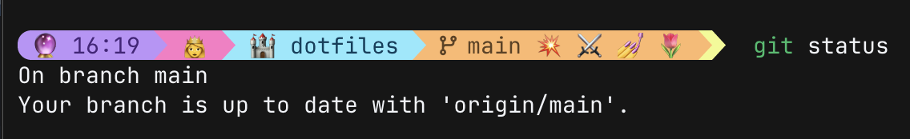
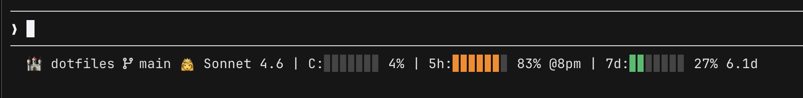

# .dotfiles

Personal development environment configuration for macOS.

### Terminal Prompt (Starship)


### Claude Code Status Line


## Setup

**Prerequisites:** macOS + [Homebrew](https://brew.sh/) + [1Password for SSH & Git](https://developer.1password.com/docs/ssh/).

### Quick Installation

1. Clone this repository:

```bash
git clone git@github.com:ErinCGallagher/dotfiles.git ~/dotfiles
cd ~/dotfiles
```

2. Create `~/.gitconfig.user` with your git identity:

```ini
[user]
  name = Your Name
  email = your@email.com
  signingkey = YOUR_SSH_SIGNING_KEY
```

To get your SSH signing key:

```bash
ssh-keygen -t ed25519 -C "your@email.com"
cat ~/.ssh/id_ed25519.pub
```

Paste the output as the `signingkey` value above.

3. Run the installation script:

```bash
./install.sh
```

The script will:

- Install all Homebrew dependencies from the Brewfile
- Create symlinks for all configuration files
- Back up any existing files before linking
- Set up proper directory structure

4. Restart your terminal or source the config:

```bash
source ~/.zshrc
```

5. Install version-managed tools:

```bash
mise install
```

## What's Included?

### Core Shell

- 🐚 **zsh** - Shell with plugins (autosuggestions, syntax highlighting)
- ⭐ **starship** - Custom prompt with Dracula theme + emojis 👸
- 🔄 **mise** - Version manager for dev tools
- 👻 **ghostty** - Terminal emulator
- 🌳 **direnv** - Auto-load environment variables
- 🔍 **fzf** - Fuzzy finder

### Development Tools

- 🔀 **git** + **diff-so-fancy** - Version control with readable diffs
- 🐙 **gh** - GitHub CLI
- 📋 **jq** - JSON processor
- 🌲 **tree** - Directory listing
- 🤖 **Claude Code** - agentic coding tool

## Troubleshooting

1. Ensure macOS and Homebrew are installed: `brew --version`
2. Re-run `brew bundle` if dependencies are missing
3. Restart your terminal after installation
